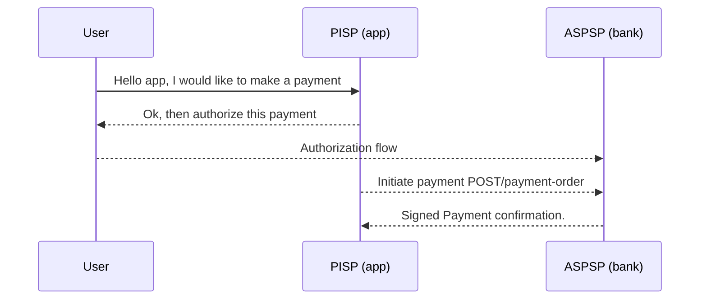

 # Openbanking.nr

A library for proving Open Banking payments using [noir](https://noir-lang.org/) language. 

## Overview
Payments in the openbanking standard produce   first-party signatures by the bank on a payment confirmation. A proof of computation over the private payment data can prove to a smart contract verifier that an offchain bank to bank payment occurred without revealing private data of any user publicly. This payment proof can be the condition to unlock an escrow smart contract or settle a programmable legal agreement. 

## Table of Contents
- [Overview](#Overview)
- [Background: The Open Banking Standard](#Background-The-open-Banking-Standard)
  - [Third-Party Providers (TPPs)](#TPPs)
  - [Signed Data ](#Signed-Data)
  - [The Payment Flow](#The-Payment-flow)
  - [Payment Initiation API](#Payment-Initiation-API-v40)
- [Cryptography in Open Banking](#Cryptography-in-Open-Banking)
  - [Trust Providers](#Trust-Providers)
  - [Signatures](#Signatures)
  - [Certificates](#Certificates)
  - [OCSP](#OCSP)
  - [TLS](#TLS12-ma)
- [PSD2 onchain: open legal questions](#PSD2-onchain-Open-Legal-Questions)
- [License to Execute](#License-to-execute)
- [The openbanking.nr lib](#The-openbankingnr-lib)
- [Future directions/questions](#future-directionsquestions)
- [Get in touch!](#Get-in-touch)
- [References](#References)


## Background: The Open Banking standard 

[Open Banking](https://en.wikipedia.org/wiki/Open_banking) is a standarized set of APIs implemented by financial institutions in some countries. It allows third party providers (TPPs) to build mobile and web applications for banking customers. 

Countries adopting open banking standards include: UK, EU, Australia, New Zealand, Nigeria and the US. 

The specific openbanking interface we explored in this research is the UK [open banking interface](https://www.openbanking.org.uk/) which is considered the leading implementation globally to my knowledge. According to this [article](https://truelayer.com/reports/open-banking-guide/open-banking-around-the-world/) EU lags behind UK by 6-12 months in implementation. 

In a nutshell, the standard enables secure and standardized communication between banks and authorized third-party providers (TPPs). With users consent, a TPP can access the user's bank information or initiate payments on their behalf. 


### TPPs 

TPPs are apps and services that invite banking users to use them (eg. insurance, fintech product..etc). 

TPPs have different permissions and are categorized into:
- **AISPs (Account Information Service Providers)**: Entities with permissions to read account and transaction data.
- **PISPs (Payment Initiation Service Providers)**: Entities authorized to initiate payments on behalf of users.

An entity might be both a AISP and a PISP. 

The bank is called **ASPSP** (Account Servicing Payment Service Provider).

### Signed Data 

The endpoints for payment initiation are signed, whereas account information endpoints are not signed. This is the reason why we explore payments in this research and how to work with those signatures. To get a sense of available data endpoints check the menu on the left in the latest [v4.0 specification](https://openbankinguk.github.io/read-write-api-site3/v4.0/profiles/account-and-transaction-api-profile.html)

(note: yes, its totally worth it to explore whether we can use TLS proofs for the Account Information, if interested about this please [get in touch!](#Get-in-touch))

### The Payment flow 

Users initialize payments with PISPs by authorizing a one off payment with their bank using [auth2.0](https://oauth.net/2/). Once authorized, the PISP initiates the payment with the bank by sending a signed payment initiation request. The bank (ASPSP) makes available a signed payment confirmation on a GET endpoint.  You can check out this [revolut tutorial](https://developer.revolut.com/docs/guides/build-banking-apps/tutorials/initiate-your-first-payment) which goes over the steps. If you decide to run it yourself check this [repo](https://github.com/mohammed7s/openbanking-revolut-template) I prepared. 


Simplified sequence diagram for PISP users: 


Detailed version of this sequence diagram in [openbanking docs](https://openbankinguk.github.io/read-write-api-site3/v4.0/profiles/payment-initiation-api-profile.html#sequence-diagram). 


### Payment Initiation API (v4.0) 

The user initiates payment through the PISP 
The payment confirmation occurs between a PISP and bank. 
The payment is signed as a JWS using PS256.  

Response Format Example: 
```
HTTP/1.1 201 Created
x-jws-signature: V2hhdCB3ZSBnb3QgaGVyZQ0K..aXMgZmFpbHVyZSB0byBjb21tdW5pY2F0ZQ0K
x-fapi-interaction-id: 93bac548-d2de-4546-b106-880a5018460d
Content-Type: application/json
 
{
  "Data": {
    "DomesticPaymentId": "7290-003",
    "ConsentId": "7290",
    "Status": "AcceptedSettlementInProcess",
    "CreationDateTime": "2017-06-05T15:15:22+00:00",
    "StatusUpdateDateTime": "2017-06-05T15:15:22+00:00",
    "Initiation": {
      "InstructionIdentification": "ANSM023",
      "EndToEndIdentification": "FRESCO.21302.GFX.37",
      "InstructedAmount": {
        "Amount": "20.00",
        "Currency": "GBP"
      },
      "DebtorAccount": {
        "SchemeName": "UK.OBIE.SortCodeAccountNumber",
        "Identification": "11280001234567",
        "Name": "Andrea Smith"
      },
      "CreditorAccount": {
        "SchemeName": "UK.OBIE.SortCodeAccountNumber",
        "Identification": "08080021325698",
        "Name": "Bob Clements"
      },
      "RemittanceInformation": {
        "Reference": "FRESCO-037",
        "Unstructured": "Internal ops code 5120103"
      }
    }
  },
  "Links": {
    "Self": "https://api.alphabank.com/open-banking/v3.1/pisp/domestic-payments/7290-003"
  },
  "Meta": {}
}
```

Status values: 
https://openbankinguk.github.io/read-write-api-site3/v4.0/resources-and-data-models/pisp/domestic-payments.html#status-2

[AcceptedSettlementCompleted, AcceptedSettlementInProcess, Pending, Rejected]
(note: further investigation is required to explore legal guarantees/implications of these status codes)

This resembles a first party signature by the bank that a speicific payment's status is confirmed. This significant attestation is the main artifact of a bank to bank transfer we are looking for. We can use this to verify it in a programmable smart contract layer. 

 
## Cryptography in Open Banking 

While TLS is used for securing communication, our interest initially is the public-key cryptography (i.e. signatures) and the trust infrastructure around it. Signatures used are mainly PS256. 

In the [Open Banking framework](https://openbankinguk.github.io/read-write-api-site3/v4.0/profiles/read-write-data-api-profile.html#key-stores), Root of trust is provided by a trust anchor which holds public keys of both parties (TPP and Bank) in a public key store allowing both to retrieve public keys as needed to veriy messages. Trust anchor could be a centralised directory such as Open Banking Directory or it could be a certificate authority (CA) that issues certificates. 

The Open Banking Directory provides a publicly accessible store of all Open Banking (OB) issued digital certificates, implemented as JSON Web Key Stores (JWKS). This store manages public keys for both TLS and signing keys.


### Trust Providers

- **Open Banking Directory (UK)**: Manages the issuance of production certificates.
  - CA: [OB Root and Issuing Certificates](https://openbanking.atlassian.net/wiki/spaces/DZ/pages/80544075/OB+Root+and+Issuing+Certificates+for+Production)
  - Open Banking Ltd.’s signature can be verified using the JWKs store located at: https://keystore.openbankingtest.org.uk/keystore/openbanking.jwks
To view quickly in  terminal: 
    ```bash
    curl -k -X GET "https://keystore.openbanking.org.uk/keystore/openbanking.jwks"
    ```

- **eIDAS Certificate Authorities (EU)**: Trust providers managing qualified certificates. (https://eidas.ec.europa.eu/efda/trust-services/browse/eidas/tls)


### Signatures

Signature standards in Open banking are based on JSON Web Signatures (JWS) defined in [RFC7515](https://datatracker.ietf.org/doc/html/rfc7515). All information about signing and verification in open banking is found [here](https://openbankinguk.github.io/read-write-api-site3/v4.0/profiles/read-write-data-api-profile.html#message-signing-2). 

The JOSE [header](https://openbankinguk.github.io/read-write-api-site3/v4.0/profiles/read-write-data-api-profile.html#step-2-form-the-jose-header) of a signature includes: 

| Claim          | Description                                                                 |
|---------------|-----------------------------------------------------------------------------|
| **typ**       | Optional claim (default: JOSE)                                             |
| **alg**       | Signing algorithm (must be PS256)                                          |
| **kid**       | Identifier to look up key in key store                                     |
| **crit**      | Must be a string array consisting of:<br> - `http://openbanking.org.uk/iat` <br> - `http://openbanking.org.uk/iss` <br> - `http://openbanking.org.uk/tan` |
| **trust anchor** | Domain name of the trust anchor                                        |


Example of a decoded Signature 
```
{
    "typ": "JOSE",
    "alg": "PS256",
    "kid": "<kid parameter of your signing certificate>",
    "crit": ["http://openbanking.org.uk/tan"],
    "http://openbanking.org.uk/tan": "<root domain of your JWKs URL>"
}
```

The KID is identifier that allows us to look up the corresponding public key in the JWKS to do message verification.  

To see how signatures are constructed with base64 encoding of data and verification steps see the standard  [here](https://openbankinguk.github.io/read-write-api-site3/v4.0/profiles/read-write-data-api-profile.html#message-signing-2) and check out the [Revolut docs on JWS](https://developer.revolut.com/docs/guides/build-banking-apps/tutorials/work-with-json-web-signatures).  


Valid Signing Algorithms:  It seems that in earlier versions [(eg.V2.0)](https://openbanking.atlassian.net/wiki/spaces/DZ/pages/127009221/Read+Write+Data+API+Specification+-+v2.0.0#Read/WriteDataAPISpecification-v2.0.0-MessageSigning.1) allowed PS256, ES256 and RS256. However in recent versions inluding the last one to date [(v4.0)](https://openbankinguk.github.io/read-write-api-site3/v4.0/profiles/read-write-data-api-profile.html#specification) states that signers must sign with PS256. 


<!-- #### JWKS: where public keys live

JWK Structure (for certificate lookup): 
Refer to the [Open Banking Directory 2.0 Technical Overview](https://openbanking.atlassian.net/wiki/spaces/DZ/pages/1150124033/Directory+2.0+Technical+Overview+v1.7) for more details.

| Claim     | Description |
|-----------|-------------|
| `kty`     | Key type. Can be EC (Elliptic Curve) or RSA. |
| `use`     | Usage of the certificate, e.g., `sig` (signature), `tls`, or `enc` (encryption). |
| `key_ops` | The key operations supported by this public key. |
| `kid`     | The SHA-1 hash of the JWK Fingerprint. |
| `x5u`     | A URL to retrieve the PEM file for the X.509 certificate. The PEM file includes the entire certificate chain. |
| `x5c`     | An array with a single element containing the base64 representation of the X.509 certificate's PEM format. |
| `x5t`     | The SHA-1 hash of the DER-encoded certificate. |
| `x5t#s256`| The SHA-256 hash of the DER-encoded certificate. -->


### Certificates


Although the JWS signature can be verified (i.e signature matchers public key), we still need to be sure the public key has been attested to by a Certificate Authority (CA) that we can trust.

In the case of UK openbanking, the certificate is issued by the OBIE Root CA. However in the EU, the certificate is issued by different CAs as specified by eiDAS. This repo is for the UK case. In the /certificates folder you can find the OBIE Root CA certificate and the issuing certificate of the OBIE Root CA. 

The trust chain is as follows: 

OB Root signs -> Issuing CA signs -> Banks's certificate -> payment endpoint 

| Certificate Type | Duration | Issue Date | Expiry Date |
|------------------|----------|------------|-------------|
| OB Root CA       | 20 years | Sep 22 11:39:42 2017 GMT | Sep 22 12:09:42 2037 GMT |
| Issuing CA       | 10 years | Sep 22 12:46:57 2017 GMT | Sep 22 13:16:57 2027 GMT |
| Bank's Certificate | 1 year | Sep 18 14:20:02 2024 GMT | Oct 18 14:50:02 2025 GMT |


In certificate verification there are always two things we need to check. 
1. There is a signature verification trail back to the Root. Where each entity signs over the public key attesting to its validity. 
2. A bank's certificate has not been revoked some time between its issuance and now. A solution to this merged as the ocsp protocol which is a fast ping service to check validity of a given certificate. The root ceritificate also signs this certificate. 

Certifates in openabanking follow [X.509](https://en.wikipedia.org/wiki/X.509) digital certificate format. 

### OCSP Protocol  

Since certificates issued to a bank is valid for a year, there is a need to check the revocation status in case the bank is no longer licensed sometime during this one year. 

Root -> OCSP Correspondor -> bank's certificate with `"status: good"`

offering an alternaive path to the root attesting to validity of a certificate. Its real time to the system that uses this endpoint. However the sync is happening on signed timestamps. Here is a response from OCSP service:

```
ocspResult {
  status: 'good',
  ocspUrl: 'http://ob.trustis.com/ocsp',
  producedAt: 2025-03-31T17:13:12.000Z,
  nextUpdate: 2025-04-03T15:49:03.000Z,
  thisUpdate: 2025-03-31T15:49:03.000Z
}
```

To use this in a smart contract, you will have to check against a timestamp to validate its valid within an acceptable time frame. There is also a signature attestation over this result by the ocsp corresponder certificate. 

In code, We used the [ocsp library](https://github.com/PeculiarVentures/node-ocsp) and the [easy-ocsp](https://github.com/PeculiarVentures/easy-ocsp) library. and obtain valid statuses using each library seperately. 

 This method is more timely and lower latency than the og method of having certificates using the certificate revocation list [(CRL)](https://en.wikipedia.org/wiki/Certificate_revocation_list) that can be periodically downloaded. 

**OCSP Stapling** 
A nice feature of ocsp, is that you can give the burden of calling the server to the person that needs to prove their certificate is valid by calling the endpoint themselves and "stapling" the signature along with the certificate. In our case, the user wants to prove to a smart contract that a certificate is valid, and a stapled proof means the smart contract does not need to worry about how to call the URL. The smart contract checks its validity by checking the signature chain over the status data goes back to the root. 

### TLS1.2-ma

For completeness we mention the TLS protocol used runs in mutual authentication mode since communiciation is two way where both client and server verify each other's identities by exchanging and verifying digital certificates in contrast to only the server's cetificate verified by the client. Check the [sequence diagrams](https://openbankinguk.github.io/read-write-api-site3/v4.0/profiles/payment-initiation-api-profile.html#sequence-diagram) that show the tls interactions betweetn tpp and aspsp to inspect where tls is used exactly. 

## PSD2 onchain: Open Legal Questions

The main directive that brought about Open banking is the [Payment Services Directive](https://en.wikipedia.org/wiki/Payment_Services_Directive) of 2015 also known as [PSD2](https://eur-lex.europa.eu/eli/dir/2015/2366). There is currently an update to the directive known as PSD3 which is still being reviewed and final text yet to be revealed, which is expected to address crypto related problems. 

The open questions however we are still searching for good answers for: 

- **Can a PISP legally transmit bank-signed payment confirmations on-chain?**
While the PISP is the only party to receive a bank’s digital signature confirming a payment, it’s unclear whether making that signature public—e.g. by embedding it in a smart contract—violates confidentiality obligations or regulatory limits on the PISP’s role.
- **Does converting HTTPS-bound confirmations into on-chain proofs undermine their legal status?**
Signatures embedded in API responses are legally meaningful in their original format. Once transmuted for blockchain use (e.g., as hashes or smart contract events), do they still meet evidentiary standards for legal recourse or dispute resolution?
- **How does GDPR apply to on-chain commitments of financial data?**
Publishing even hashed or encrypted data may still count as “personal data” under GDPR. If users later invoke their right to deletion, does deleting a decryption key or access path satisfy the law, or does the immutable nature of blockchain create compliance conflicts?
- **Can KYC/AML be abstracted or ported across multiple PISPs?**
PSD2 and GDPR promote data portability, but financial institutions are still liable for their own compliance. Can a user reuse verified credentials across providers, and if so, who is accountable when reused credentials prove insufficient or fraudulent?
- **Do Open Banking rights override provider Terms of Service?**
Some banks or fintechs restrict how their APIs and data outputs can be used. If users or services transform this data for blockchain verification, are they protected by statutory rights to data access and portability, or bound by the ToS they accepted?
- **What happens when a PSD2 license is revoked within a decentralized network?**
If one provider is shut down, who is responsible for maintaining service continuity or preserving legal evidence? Does the network itself have obligations, or can coordination among nodes mitigate regulatory fallout?
- **Are clawbacks, disputes, and reversals compatible with on-chain “finality”?**
In traditional banking, payments can be reversed or refunded. How should smart contracts, which often treat data as immutable and final, accommodate the messy reality of payment disputes or fraud?

These questions '' at the intersection of regulatory compliance, cryptographic trust, and data governance—and
remain unaddressed explicitly by current law or standards. If you have deep knowledge/understanding in this area, we would love to hear from you!

## License to execute

Access to these APIs -and therefore the valuable signatures- in the UK requires a TPP to be licnesed under the Financial Conduct Authority ([FSA](https://www.fca.org.uk/firms/electronic-money-payment-institutions)) as a payment institution. By default this comes with guarantees that the TPP will conduct throrough AML checks. If the TPPs is facilitating payment initiation to a merchant, they need to KYB the merchant. 


## BOLT (demo app)

We present a simple escrow for token exchange where the token is released to the opnebaning proof of payment. To try it yourself, create a revolut openabanking business test account using an email address and go use it at [bolts.money](https://bolts.money)


## The openbanking.nr lib


The openbanking.nr library implements the circuits that verify a bank's signature over the payment data, along with the helper code required to use this library in practise. The components include:

- [ ] RSA-PSS (PS256) signature verification
- [ ] JWS Parsing 
- [ ] Javascript API
- [ ] Escrow smart contracts
- [ ] Certificate verification
- [ ] Payment templates (domestic, international..etc)
- [ ] PISP e2e example with JS 
 

## Future directions

- TLS proofs!: Account and transaction history flows between the AISP and the bank are not signed. Otherwise obtaining history would be a more convenient way to prove a payment rather than doing it one by one with the payment signatures approach. However, it could be interesting to use a tls notary to perhaps prove those communications.  

## Get in touch! 
Join openbanking.nr [telegram channel](https://t.me/+tVjIqZFR278zMTk0) to follow progress and get in touch. 


### References 

- [openbanking.nr Implementation](https://github.com/attested-frontiers/openbanking.nr-circuit)
- [Open Banking API spec](https://openbankinguk.github.io/read-write-api-site3/v4.0/profiles/read-write-data-api-profile.html)
- Revolut Open Banking docs: 
https://developer.revolut.com/docs/build-banking-apps
- OpenID (The underlying standard the openabanking is based on) :  
https://openid.net/specs/openid-financial-api-part-2-1_0.html
- OAuth2.0: https://oauth.net/2/ 
- Open Banking Directory root certificates: https://openbanking.atlassian.net/wiki/spaces/DZ/pages/80544075/OB+Root+and+Issuing+Certificates+for+Production
- RFC 7515 - JSON Web Signature (JWS): https://datatracker.ietf.org/doc/html/rfc7515
RFC 7517 - JSON Web Key (JWK): https://datatracker.ietf.org/doc/html/rfc7517
RFC 6749 - OAuth 2.0 Authorization Framework: https://datatracker.ietf.org/doc/html/rfc6749

